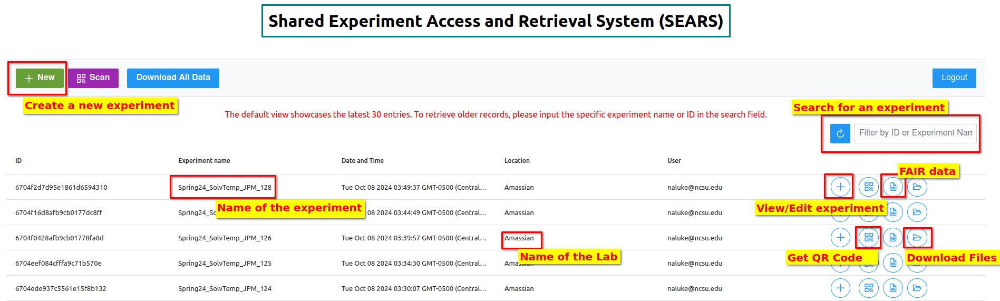
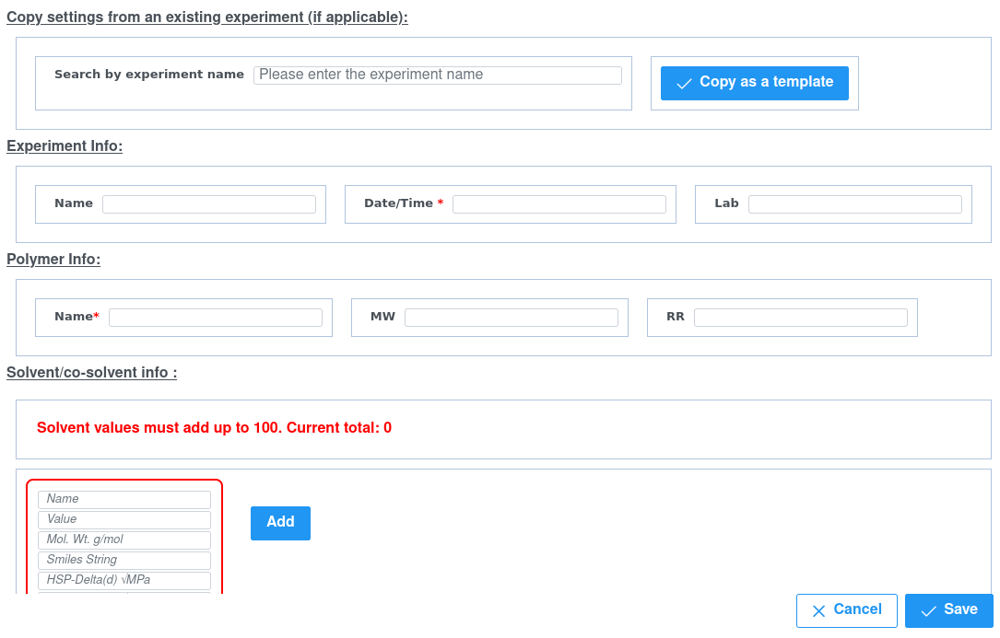
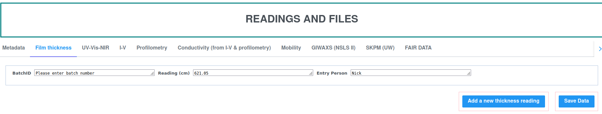

# SEARS: Shared Experiment Aggregation and Retrieval System

SEARS (Shared Experiment Aggregation and Retrieval System) is an open-source, cloud-based platform developed to simplify and accelerate experimental data management in materials science. Originally created to facilitate research on doping in organic semiconductors, SEARS serves as a comprehensive digital infrastructure for data storage, retrieval, sharing, and analysis, promoting efficient collaboration among interdisciplinary teams. A demo of the SEARS platform is placed [here](https://iastate.box.com/s/6lug1vunq4uhnpdrsl5gxa5l3sf8hcz6)

## Why SEARS?

Modern materials science is increasingly data-intensive, integrating robotic automation, machine learning (ML), and collaborative experiments. SEARS addresses the following critical needs:

* Data Complexity Management: Handles diverse, multi-modal data types (metadata, numerical results, raw experimental files).

* FAIR Compliance: Ensures data is Findable, Accessible, Interoperable, and Reusable through structured metadata and standard ```json``` format. You can download your experiments in ```FAIR``` format by just 1-click and upload it to any platform that accepts FAIR data.

* Real-Time Collaboration: Supports seamless multi-laboratory collaboration powered via a very rich and intuitive interface, centralized storage and data security protocols that prevent data loss.

* ML Integration: Facilitates adaptive experiment design and data-driven discovery using built-in ML compatibility powered via our python powered software development kit [here](https://github.com/baskargroup/SEARS-Data-Pull).

## Key Features

* Customizable Ontologies: Tailor data schemas to fit specific research requirements. Modify and extend ontologies to keep pace with evolving needs without impacting existing experiments.

* Full Measurement Tracking: Log all experiment results for a particular sample in one place along with the metadata i.e. who, when and where.

* Intuitive Web Interface: User-friendly and responsive front-end providing a centralized dashboard, quick experiment creation, QR-coded experiment retrieval, and advanced search functionality.

* Secure, Scalable Backend: Built with ```NoSQL (MongoDB)``` for efficient, schema-flexible data storage and vendor agnostic cloud-based deployment for fast and reliable performance.

* Dual-Redundant File Storage: Ensures data integrity and security with parallel cloud-based and in-house file storage solutions.

* Comprehensive API Ecosystem: Modern ```REST``` API-driven architecture facilitating effortless integration with external analysis and visualization tools.

## Use Cases and Impact

SEARS has demonstrated significant impact through various case studies:

* Adaptive Design of Experiments (ADoE): Enabled iterative experimental design for optimizing doping processes in conjugated polymers.

* Quantitative Structure-Property Relationship (QSPR) Modeling: Facilitated predictive modeling of material properties from processing conditions.

* FAIR Data Sharing: Ensured research data was easily downloadable in standardized, FAIR-compliant formats.

* Multi-Facility Data Integration: Centralized aggregation of experimental data from different labs and analytical instruments, enhancing reproducibility and transparency.

## Getting Started

* Installation: Detailed developer installation guidelines available [here](#set-up-instructions).
* Modifications : Instructions to Modify SEARS i.e., adding or deleting new screens to fit your needs are [here](https://github.com/baskargroup/SEARS/blob/master/ADDING_REMOVING%20NEW%20SCREENS%20-%20SEARS.pdf). Note : Making these changes automatically makes modifications in the MongoDB backend.

* FAIR Documentation: Please refer to our FAIR portal [here](https://v0-fair-data-webpage.vercel.app) for a detailed list of field names used in SEARS. 
  
* Community and Contributions: Contributions to SEARS are welcome! Please reach out to us via the ```Discussions``` section in the top menu bar if you have any questions.

## License

SEARS is released under the MIT license, promoting open science, reproducibility, and collaborative research advancement.

# Select Screen Shots from the SEARS Application
You can see a preview of the application in the screenshots below

## Dashboard


## Create a New Experiment


## View/Edit and Experiment



# Set Up Instructions

## MongoDB
Prerequisites:
1. Sign up for MongoDB Atlas Service
2. Create a new database under your account called "dope"
3. Create a collection inside the "dope" database called "productData"
4. Set up Authentication. Under Services [Left Menu] >> Triggers >> View All Apps [Top Right Corner] >> Create New App [Top Right Corner]. Give it a name. Then go into this App >> Under Data Access [Left menu] >> Authentication >> Users >> Add a new User (It will ask you for email and a password - later the user can reset the password). Also under Authentication Providers Enable "Email/Password".
5. Create a AWS Bucket.

Steps:
1. Inside the "App" that you created. In the Left hand menu under "BUILD", click on Functions.
2. Reading from the files under the folder /mongodb in this folder, create identical functions in MongoDB atlas by clicking on "Add a Function" [Top Right Corner]
3. The names of these functions should match the file names under ./mongodb and then copy paste all the content correspondingly. 

## Backend
Prerequisites
1. On your server, install Python 3.10
2. Copy the content of ./dope-backend to a server location.
3. Add a .env file to your ./dope-backend directory (now on your server) with the following entries
   ```
   ACCESS_KEY = <AWS ACCESS KEY>
   SECRET_KEY = <AWS SECRET KEY>
   BUCKET_NAME = <AWS BUCKET NAME>
   GROUP_ID = <MONGO DB ACCOUNT GROUP ID>
   APP_ID = <MONGO DB APP ID FROM PRE-REQ STEP 4>
   admin_username = <MONGO DB ADMIN USERNAME>
   admin_apiKey = <MONGOD DB Private API KEY>
   ```
Steps:

1. ```pip3 -r requirements.txt```
2. ```python3 app.py```

## Frontend
1. On your server, install node.js (process  varies by OS. Refer to node.js documentation) 
2. Copy the content of ./dope-frontend to a server location.
3. Add a .env file to your ./dope-frontend directory (now on your server) with the following entries
   ```
   REACT_APP_MONGO_APP_ID=<APP_ID FROM MONGODB ATLAS APP CREATED IN PRE-REQ 4>
   REACT_APP_DIGITAL_OCEAN_URL=DIGITAL_OCEAN_URL=<dope_backend_url>/upload_file/
   REACT_APP_ADMIN_ACCOUNT="<admin's email account>"
   ```
4. ```npm install```

Steps
1. ```npm run start```


