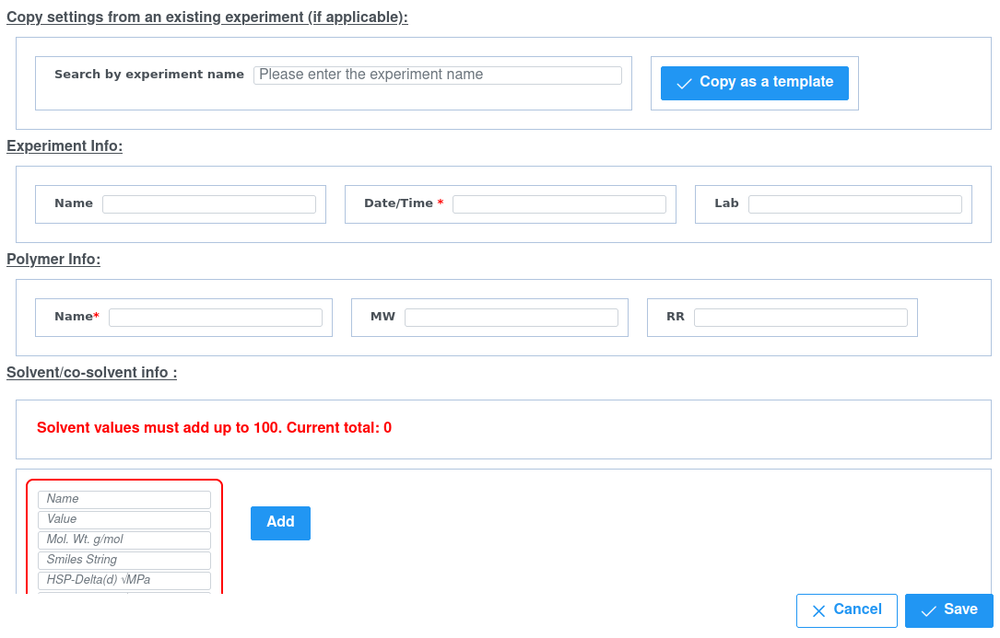

# Set Up Instructions

## MongoDB
Prerequisites:
1. Sign up for MongoDB Atlas Service
2. Create a new database under your account called "dope"
3. Create a collection inside the "dope" database called "productData"
4. Set up Authentication. Under Services [Left Menu] >> Triggers >> View All Apps [Top Right Corner] >> Create New App [Top Right Corner]. Give it a name. Then go into this App >> Under Data Access [Left menu] >> Authentication >> Users >> Add a new User (It will ask you for email and a password - later the user can reset the password). Also under Authentication Providers Enable "Email/Password".
5. Create a AWS Bucket.

Steps:
1. Inside the "App" that you created. In the Left hand menu under "BUILD", click on Functions.
2. Reading from the files under the folder /mongodb in this folder, create identical functions in MongoDB atlas by clicking on "Add a Function" [Top Right Corner]
3. The names of these functions should match the file names under ./mongodb and then copy paste all the content correspondingly. 

## Backend
Prerequisites
1. On your server, install Python 3.10
2. Copy the content of ./dope-backend to a server location.
3. Add a .env file to your ./dope-backend directory (now on your server) with the following entries
   ```
   ACCESS_KEY = <AWS ACCESS KEY>
   SECRET_KEY = <AWS SECRET KEY>
   BUCKET_NAME = <AWS BUCKET NAME>
   GROUP_ID = <MONGO DB ACCOUNT GROUP ID>
   APP_ID = <MONGO DB APP ID FROM PRE-REQ STEP 4>
   admin_username = <MONGO DB ADMIN USERNAME>
   admin_apiKey = <MONGOD DB Private API KEY>
   ```
Steps:

1. ```pip3 -r requirements.txt```
2. ```python3 app.py```

## Frontend
1. On your server, install node.js (process  varies by OS. Refer to node.js documentation) 
2. Copy the content of ./dope-frontend to a server location.
3. Add a .env file to your ./dope-frontend directory (now on your server) with the following entries
   ```
   REACT_APP_MONGO_APP_ID=<APP_ID FROM MONGODB ATLAS APP CREATED IN PRE-REQ 4>
   REACT_APP_DIGITAL_OCEAN_URL=DIGITAL_OCEAN_URL=<dope_backend_url>/upload_file/
   REACT_APP_ADMIN_ACCOUNT="<admin's email account>"
   ```
4. ```npm install```

Steps
1. ```npm run start```


# Select Screen Shots of SEARS Application
You can see a preview of the application in the screenshots below

## Dashboard


## Create a New Experiment


## View/Edit and Experiment


